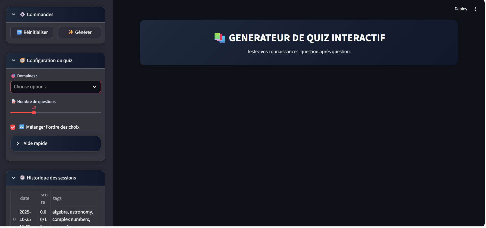
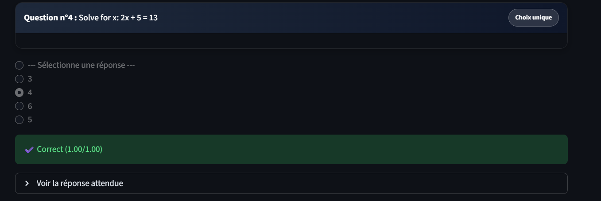
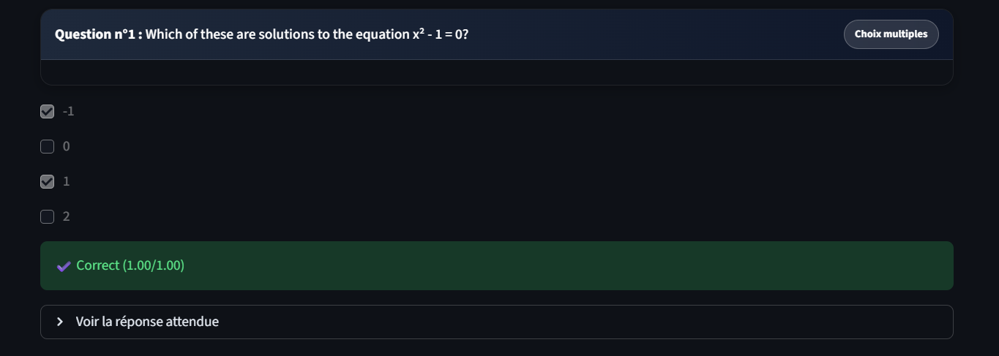
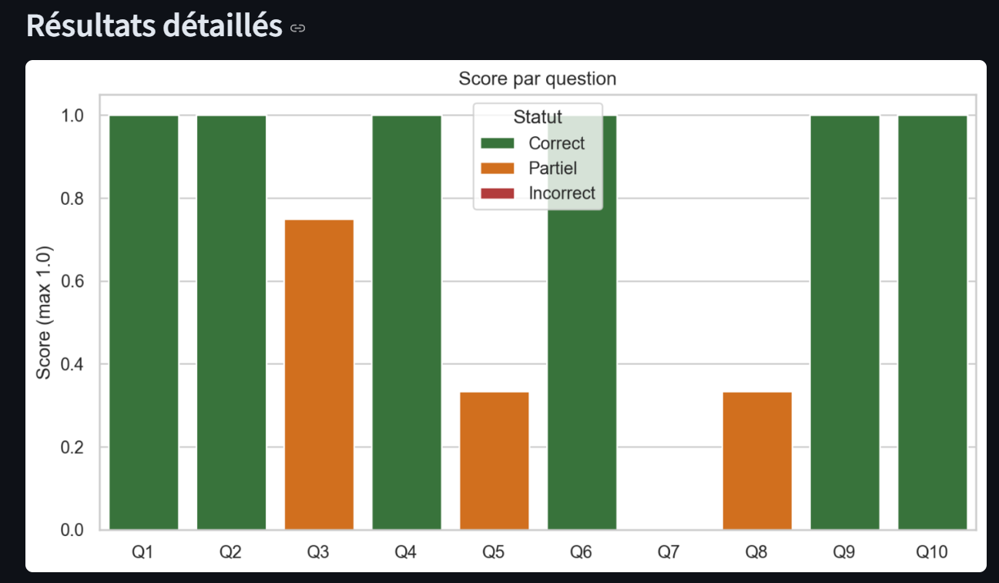
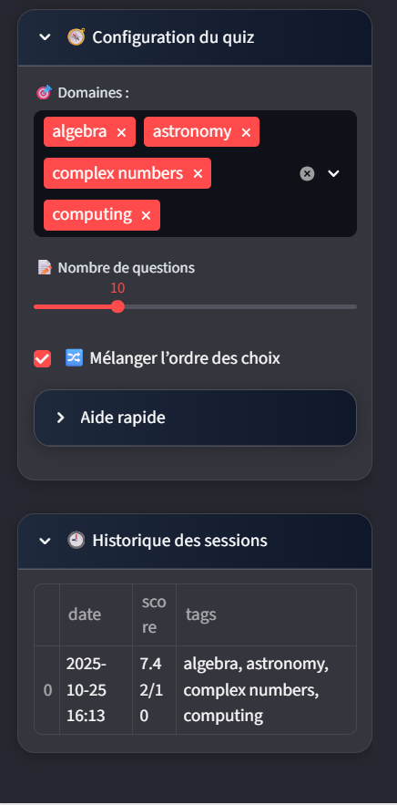
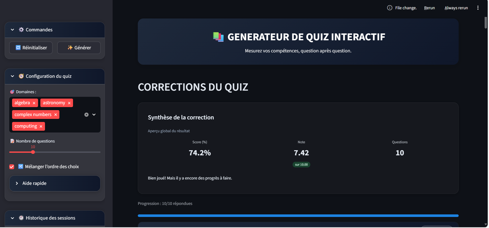
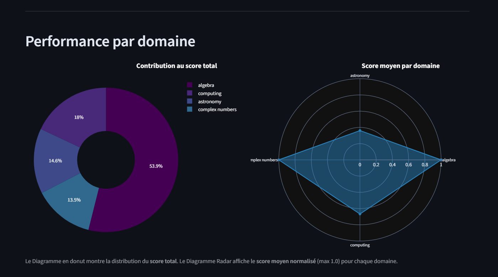

📚 GENERATEUR DE QUIZ INTERACTIF (Python + Streamlit + OOP)

**Objectif du projet**

L’objectif de ce projet est de créer une **application web interactive** permettant de générer, corriger et analyser des quiz de manière dynamique.
Elle combine **Python, la programmation orientée objet (OOP) et Streamlit**, et est conçue pour fournir :

    - Une expérience d’apprentissage interactive.

    - Une correction instantanée avec feedback visuel.

    - Des visualisations claires des performances par question et par domaine.

Ce projet peut être utilisé pour l’éducation, la formation interne ou simplement pour tester ses connaissances dans divers domaines.


🛠️ **Architecture du Projet**
L'architecture du projet est structurée pour assurer maintenabilité et clarté.

**Arborescence**
Le projet suit l'arborescence exacte suivante :

ASSIGNMENT/
├── IMAGES/
│   ├── Image01.png
│   ├── Interface_appli.png
│   ├── Performances_par_domaine.png
│   ├── Presentation_des_question_multiple.png
│   ├── Presentation_des_question_simple.png
│   ├── Resultats_detaillees.png
│   └── sidebar.png
├── app.py                    # Script principal streamlit(Vue et Contrôleur)
├── Diagramme_UML.pdf         # Pdf contenant le diagramme_UML      
├── models.py                 # Définit les classes métier (Modèles)
├── quiz_dataset.json         # Banque de questions source
├── README.md                 # Le readme detaillée
└── requirements.txt          # Liste des dépendances Python


**Classes de Logique Métier (models.py)**

Voici un tableau présentant les classes principales et leur rôle :

_______________________________________________________________________________________________________________
**Classe**            **Rôle Principal**          **Description du Fonctionnement**
_______________________________________________________________________________________________________________
Question              Modèle de Données           Représente une question unique (texte, choix, correction, mode, tags).

QuestionDataset     Source de Données           Charge les questions depuis quiz_dataset.json et gère le filtrage par   tags.

QuizGenerator       Logique de Génération       Sélectionne un sous-ensemble aléatoire de questions basé sur la configuration de l'utilisateur.

QuizCorrector       Moteur de Correction        Calcule le score obtenu, y compris la notation partielle pour les choix multiples.

QuizView            Vue & Contrôleur (app.py)   Gère l'affichage Streamlit, l'état de session, et orchestre les autres classes pour l'exécution du quiz.
________________________________________________________________________________________________________________

## Fonctionnalités principales

### 1. Génération de quiz

- Sélection par **domaine / tags** pour adapter le quiz aux besoins de l’utilisateur.  
- Choix du **nombre de questions** (3 à 30).  
- **Mélange automatique des réponses** pour éviter la mémorisation mécanique.  
- Support des **questions à choix unique** et **questions à choix multiples**.

  

---

### 2. Interaction et correction automatique

- Progression visible via barre et compteur.  
- Calcul automatique du **score global et par question**.  
- Affichage immédiat des **réponses correctes** avec feedback visuel (Correct / Partiel / Incorrect).  
- Historique des sessions et des scores pour suivre la progression.

  
  
  
(IMAGES/sidebar.png)  
  
---

### 3. Visualisation des performances

- **Diagramme Donut** : Contribution de chaque domaine au score total.  
- **Diagramme Radar** : Score moyen par domaine (normalisé sur 1.0).  
- Graphique en barres : Score par question avec indication Correct / Partiel / Incorrect.  
- Téléchargement des résultats au format CSV pour analyse complémentaire.

  

---

## ⚙️ Technologies et bibliothèques utilisées

| Technologie / Bibliothèque     | Utilisation                            |
|--------------------------------|----------------------------------------|
| Python 3.10                    | Langage principal                      |
| Streamlit                      | Interface web interactive              |
| Pandas                         | Manipulation et traitement des données |
| Seaborn / Matplotlib           | Graphiques par question                |
| Plotly Express / Graph Objects | Visualisations interactives par domaine|
| JSON                           | Stockage des questions                 |
|________________________________|________________________________________|


---

## Installation et exécution

1. Installer les dépendances Python :

```bash
pip install -r requirements.txt
```

2. Lancer l’application : 
```Powershell
streamlit run app.py
```

---

## Fonctionnalités et workflow bien detaillées

### 1. Interface et configuration

L'application est lancée et configurée via une interface utilisateur claire.

**Interface Générale :** Représentation de l'application  


**Barre Latérale (Sidebar) :** Permet la configuration du quiz, incluant la sélection des domaines, le nombre de questions, et l'accès à l'historique des sessions.  


---

### 2. Saisie et Correction des Questions

La correction s'affiche immédiatement après la soumission du quiz, offrant un **feedback instantané**.

**Choix simple :** Gestion des questions à réponse unique.  


**Choix multiples :** Gestion des questions à réponses multiples, avec notation partielle.  


---

### 3. Synthèse des Résultats

Après la soumission des réponses, l'application affiche une **synthèse des résultats**, incluant une note normalisée sur 10.

| Métrique      | Description                                       |
|---------------|---------------------------------------------------|
| **Score (%)** | Pourcentage de réussite global                    |
| **Note**      | Score total normalisé sur 10                      |
| **Questions** | Nombre total de questions du quiz                 |
|_______________|___________________________________________________|

**Exemple de synthèse des scores après correction** :  


---

### 4. Visualisation des Performances

#### A. Score par question

Un graphique à barres affiche le score obtenu (max 1.0) pour chaque question, avec distinction des statuts **Correct**, **Partiel** ou **Incorrect**.  


#### B. Performance par Domaine

Les graphiques **Plotly** (Donut et Radar) permettent d’analyser la performance par domaine sélectionné, offrant un aperçu visuel des forces et axes d'amélioration.  


---

## Contribution

Les contributions sont les bienvenues ! Si vous souhaitez améliorer ce projet, veuillez **forker le dépôt** et soumettre une **Pull Request**.

---
